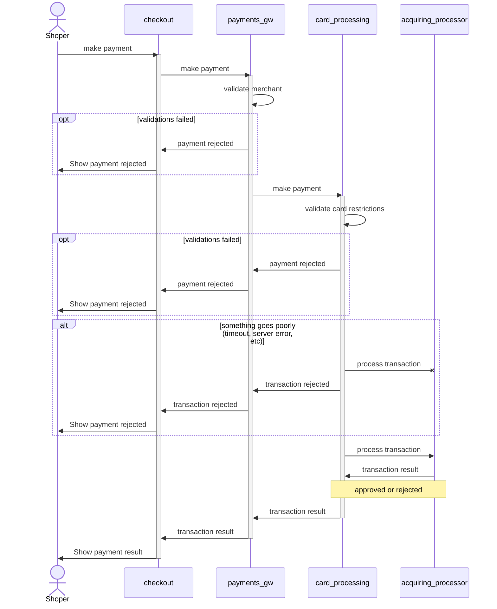

<p align="center">
  <a href="https://nextjs-fastapi-starter.vercel.app/">
    
    <h3 align="center">Next.js FastAPI Starter</h3>
  </a>
</p>

<p align="center">Simple Next.js boilerplate that uses <a href="https://fastapi.tiangolo.com/">FastAPI</a> as the API backend.</p>

<br/>

## Stack:

- Vercel to deploy the API REST
- FastAPI as the API REST developement framework
- PostgreSQL as the data base, no reason in particular more than the ease of use and wide support, also hosted in
  Vercel.
- Python as programming language, heavily used as an Object Oriented Programing Language, in company of pydantic for a
  strong typing.

# Asumptions

I assumed we were operating at a high scale, and that the Gateway would grow very rapidly, not only in terms of
transactions but also in the variety of payment methods.

# Introduction

Hi, I'm Julio César Indriago, and this is my representation of a Payment Gateway.

The key feature of this implementation is the approach in terms of cognitive load and the distribution of components,
which, in my experience, functions as a separation of teams and concerns.

This design takes into account how Conway's Law operates. Ultimately, there should be two teams: one in charge of the
Payment Gateway and another responsible for abstracting the complexities of the card processing world. This naturally
leads to a separation of concerns.

In the following diagram, you can see how the components are laid out and interact.



Certainly, this will bring some trade-offs in terms of message mapping, but with the proposed division, that trade-off
becomes less significant in favor of loose coupling and high cohesion.

Finally, the CardProcessing component is deliberately complex to accommodate potential growth:

It includes a service to obtain card information based on the PAN.
There is a simple router that routes the transaction, changing acquiring banks depending on the franchise.
We conclude with a retry logic for the transaction, allowing us to attempt recovery of approvals.

# The Database

The table definition is in the file `queries.sql` at the root of the project if you want to run it locally.

## How to run it?
This is a hybrid Next.js + Python app that uses Next.js as the frontend and FastAPI as the API backend. One great use case of this is to write Next.js apps that use Python AI libraries on the backend.

## How It Works

The Python/FastAPI server is mapped into to Next.js app under `/api/`.

This is implemented using [`next.config.js` rewrites](https://github.com/digitros/nextjs-fastapi/blob/main/next.config.js) to map any request to `/api/:path*` to the FastAPI API, which is hosted in the `/api` folder.

On localhost, the rewrite will be made to the `127.0.0.1:8000` port, which is where the FastAPI server is running.

In production, the FastAPI server is hosted as [Python serverless functions](https://vercel.com/docs/concepts/functions/serverless-functions/runtimes/python) on Vercel.

## Demo

https://nextjs-fastapi-starter.vercel.app/

## Deploy Your Own

You can clone & deploy it to Vercel with one click:

[](https://vercel.com/new/clone?repository-url=https%3A%2F%2Fgithub.com%2Fdigitros%2Fnextjs-fastapi%2Ftree%2Fmain)

## Developing Locally

You can clone & create this repo with the following command

```bash
npx create-next-app nextjs-fastapi --example "https://github.com/digitros/nextjs-fastapi"
```

## Getting Started

First, install the dependencies:

```bash
npm install
# or
yarn
# or
pnpm install
```

Then, run the development server:

```bash
npm run dev
# or
yarn dev
# or
pnpm dev
```

Open [http://localhost:3000](http://localhost:3000) with your browser to see the result.

The FastApi server will be running on [http://127.0.0.1:8000](http://127.0.0.1:8000) – feel free to change the port in `package.json` (you'll also need to update it in `next.config.js`).

## Looking Forward
### Things to improve
- The mapping of the network response could be to direct, so a mapper to standarize the response message could improve readability.
- I'll creat an `adapters` package and separate each adapter in its own module so evolution won't obstruct readability.

## Learn More

To learn more about Next.js, take a look at the following resources:

- [Next.js Documentation](https://nextjs.org/docs) - learn about Next.js features and API.
- [Learn Next.js](https://nextjs.org/learn) - an interactive Next.js tutorial.
- [FastAPI Documentation](https://fastapi.tiangolo.com/) - learn about FastAPI features and API.

You can check out [the Next.js GitHub repository](https://github.com/vercel/next.js/) - your feedback and contributions are welcome!
